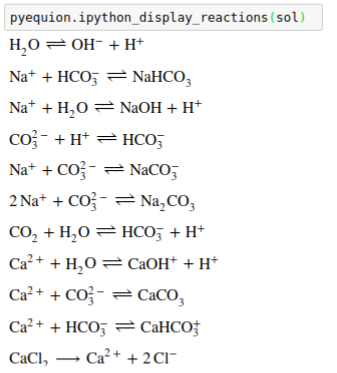

Getting Started
===========================

The equilibrium for a mixture of salts can be calculate as: ::

    import pyequion
    sol = pyequion.solve_solution({'NaHCO3': 50, 'CaCl2': 10})
    pyequion.print_solution(sol)
    >> Solution Results:
    >>    pH = 7.86640
    >>    sc = 6602.68061 uS/cm
    >>    I = 73.74077 mmol/L
    >>    DIC = 50.00000 mmol/L
    >> Saturation Index:
    >>    Halite: -4.77905928064043
    >>    Calcite: 2.083610139715626
    >>    Aragonite: 1.9398402923233906
    >>    Vaterite: 1.5171786455013265

Additionally, the envolved reactions can be listed:

The options are organized as the `pyequion.solve_solution` arguments.
For instance, in the next code block the same mixture equilibrium is solved for:
(i) precipitation with the calcite phase; (ii) open system  equilirium with atmospheric partial pressure of CO2;
(iii) using the Pitzer method and (iv) with the Peng-Robinson equation of state for the CO2(g). ::

    sol = pyequion.solve_solution(
        {'NaHCO3': 50, 'CaCl2': 10},
        allow_precipitation=True,
        close_type=pyequion.ClosingEquationType.OPEN,
        activity_model_type='pitzer',
        solid_equilibrium_phases=['Calcite'],
        co2_partial_pressure=pyequion.pCO2_ref,
        fugacity_calculation='pr',
    )
    pyequion.print_solution(sol)
